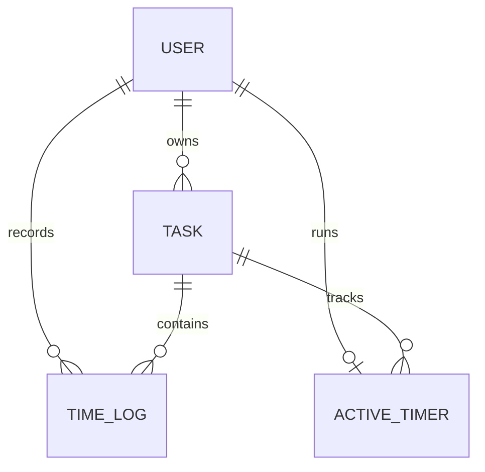

# Tempo — Project Architecture

## Overview

Tempo is a React and NestJS task/time tracking application. It uses **PostgreSQL** (hosted on Aiven Cloud) through **Prisma ORM**, providing production-grade persistence, connection pooling, and cross-platform compatibility.

## Applications

- `frontend/`: React/Vite client. Models define contracts, services isolate HTTP, controller hooks coordinate state, and views/components render the UI with accessible charts and notifications.
- `backend/`: NestJS REST API. Controllers manage HTTP, DTOs validate input, services contain business rules, repositories enforce scoped data access, and Prisma persists PostgreSQL records.

```text
Request → controller → validation/JWT guard → service → repository → Prisma → PostgreSQL
```

Swagger is generated from the live controllers and DTOs and served at `/docs`.

## Security

- Password hashing uses bcrypt cost 12.
- Seven-day JWTs are stored in HTTP-only SameSite cookies.
- Protected controllers use `JwtAuthGuard`.
- Owned records are queried using both resource ID and authenticated user ID.
- Foreign and missing resources produce the same `404` response.
- DTO whitelist validation rejects unknown fields.
- Helmet, exact-origin CORS and standardized error responses are configured globally.

## Database



`ActiveTimer.userId` is database-unique, preventing simultaneous active timers per user.

Completed sessions become `TimeLog` rows. Timer deletion, log creation and task-total updates occur inside Prisma transactions. Editing or deleting a time log corrects its task aggregate in the same transaction.

Database migrations and seeds are version-controlled with Prisma and PostgreSQL.

## Daily & Weekly Summary

The browser supplies its timezone offset. The API converts local midnight boundaries to UTC, aggregates the selected day/week, includes live timer state, and returns status counts, focus duration totals, and circadian rhythm heatmaps.

## API response format

```json
{ "success": true, "data": {} }
```

```json
{
  "success": false,
  "error": {
    "code": "NOT_FOUND",
    "message": "Task not found.",
    "path": "/api/v1/tasks/id",
    "timestamp": "2026-09-11T10:00:00.000Z"
  }
}
```

## Deployment guidance

Because Tempo uses managed PostgreSQL (Aiven Cloud), the backend API is completely stateless and ready for deployment on platforms like Render, Railway, Fly.io, or AWS. The frontend builds to static assets for deployment on Vercel, Netlify, or Cloudflare Pages.
