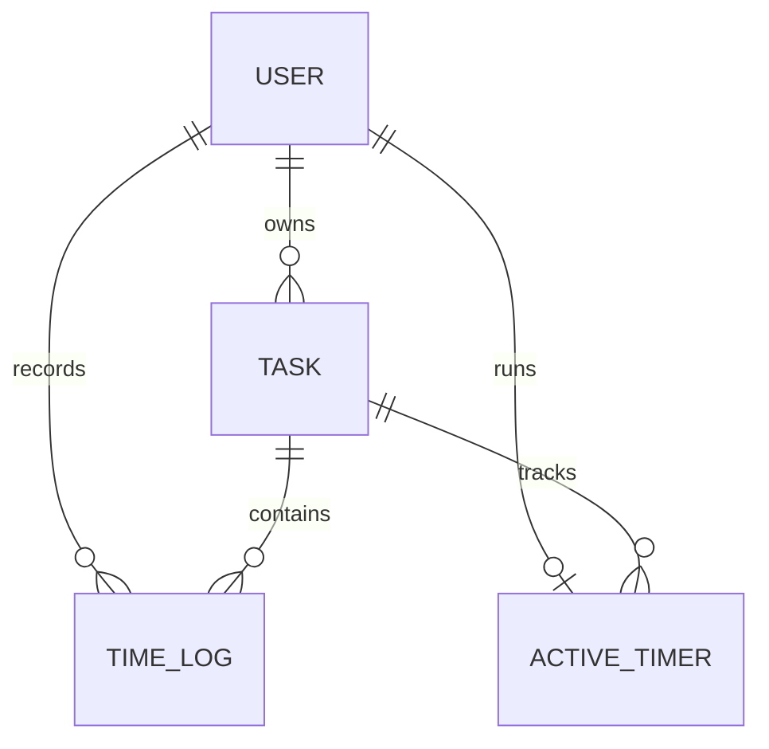

# Tempo — Project Architecture

## Overview

Tempo is a React and NestJS task/time tracking application. It uses PostgreSQL through Prisma, supporting both cloud database instances (such as Aiven PostgreSQL) and local instances.

## Applications

- `frontend/`: React/Vite client. Models define contracts, services isolate HTTP, controller hooks coordinate state, and views/components render the UI.
- `backend/`: NestJS REST API. Controllers manage HTTP, DTOs validate input, services contain business rules, repositories enforce scoped data access, and Prisma persists PostgreSQL records.

```text
Request → controller → validation/JWT guard → service → repository → Prisma → PostgreSQL
```

Swagger is generated from the live controllers and DTOs and served at `/docs`.

## Security

- Password hashing uses bcrypt cost 12.
- Seven-day JWTs are stored in HTTP-only SameSite cookies.
- Protected controllers use `JwtAuthGuard`.
- Owned records are queried using both resource ID and authenticated user ID.
- Foreign and missing resources produce the same `404` response.
- DTO whitelist validation rejects unknown fields.
- Helmet, exact-origin CORS and standardized error responses are configured globally.

## Database



SQLite does not provide native enums, so task status and priority are stored as strings and validated using TypeScript enums plus `class-validator` DTOs. `ActiveTimer.userId` remains database-unique.

Completed sessions become `TimeLog` rows. Timer deletion, log creation and task-total updates occur inside Prisma transactions. Editing or deleting a time log corrects its task aggregate in the same transaction.

The local database lives at `backend/prisma/dev.db` and is excluded from Git. The migration and seed remain version controlled.

## Daily summary

The browser supplies its timezone offset. The API converts local midnight boundaries to UTC, aggregates the selected day, includes a live timer, and returns status counts plus per-task duration totals.

## API response format

```json
{ "success": true, "data": {} }
```

```json
{
  "success": false,
  "error": {
    "code": "NOT_FOUND",
    "message": "Task not found.",
    "path": "/api/v1/tasks/id",
    "timestamp": "2026-09-11T10:00:00.000Z"
  }
}
```

## Deployment guidance

SQLite is appropriate for local review and a single API instance. Production deployment must attach persistent storage for the database file. PostgreSQL is the intended upgrade when the application needs multiple replicas, higher write concurrency or managed backups.
