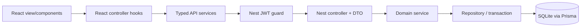
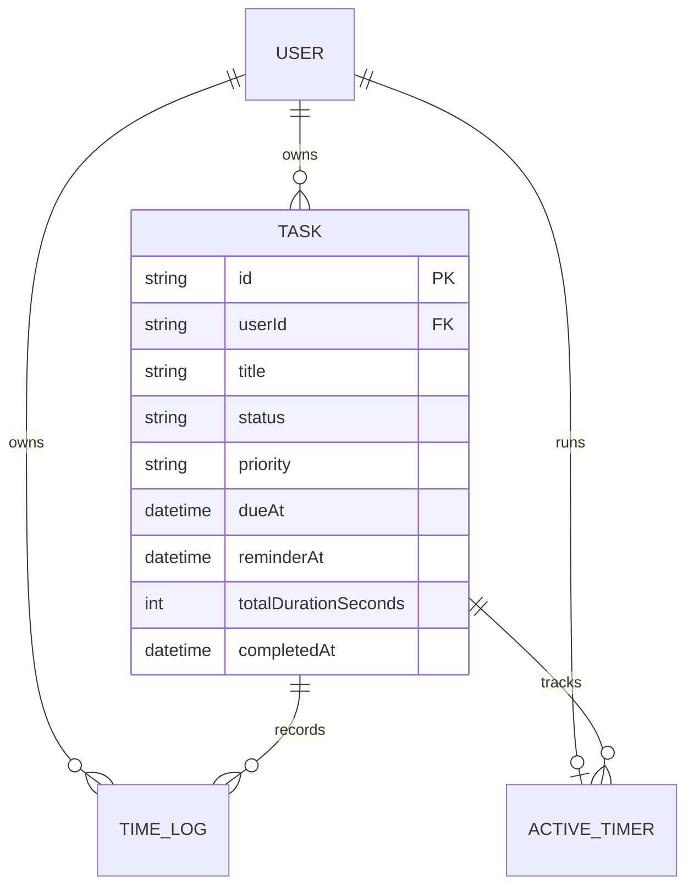

# Tempo — Task and Time Tracking

Tempo is a full-stack productivity workspace for managing tasks, tracking focused work in real time, scheduling reminders, and understanding daily and weekly productivity. It was built for the Full Stack Task and Time Tracking assessment as two independent TypeScript applications—React for the client and NestJS for the API—with SQLite so it runs without Docker.

## Review links and credentials

| Resource | Location |
| --- | --- |
| Frontend, local | <http://localhost:5173> |
| REST API | <http://localhost:3000/api/v1> |
| Swagger UI | <http://localhost:3000/docs> |
| Live deployment | Not published from this workstation; add the deployed URL here before submission |
| Demo email | `reviewer@tempo.app` |
| Demo password | `Review123!` |

> The Swagger UI remains available to API reviewers but is intentionally not linked from the product navigation. The customer-facing interface contains only product actions.

## Assessment coverage

| Requirement | Implementation | Status |
| --- | --- | --- |
| Sign up, login, logout | JWT session stored in an HTTP-only cookie; bcrypt cost factor 12 | Complete |
| Protected frontend routes | Auth controller restores the session and redirects unauthenticated users | Complete |
| API authorization | NestJS JWT guard plus user-scoped repository queries on every protected resource | Complete |
| Task CRUD | Create, list, search, filter, edit, status transitions, priority, delete | Complete |
| Natural-language input | Deterministic local refinement for title, description, and inferred priority; no paid key needed | Complete |
| Real-time tracking | Server-authoritative start/stop, live elapsed UI, one active timer per user | Complete |
| Time logs | Automatic and manual logs, list, correction, deletion, duration reconciliation | Complete |
| Daily summary | Local-day totals, completion/status counts, task focus distribution | Complete |
| API quality | Versioned REST API, DTO validation, consistent envelopes, status codes, Swagger | Complete |
| Responsive UI | Desktop, tablet, mobile navigation, keyboard focus, reduced-motion support | Complete |
| Bonus: productivity chart | Accessible seven-column focus chart generated from real time logs | Complete |
| Bonus: weekly summary | Seven-day totals, daily average, active days, completed count, best day | Complete |
| Bonus: reminders | Persisted due/reminder dates, upcoming API, overdue UI, browser notifications | Complete |
| Live deployment URL | Requires a hosting account and persistent volume | Pending before final submission |

## Product highlights

- Premium editorial interface with light typography, restrained gold accents, responsive layouts, and a custom Tempo clock favicon.
- Secure account isolation: a valid task or log ID is insufficient without matching the authenticated `userId`.
- Accurate timer lifecycle: stopping a timer deletes the active record, creates the time log, and increments the task total in one transaction.
- Concurrency protection: the database enforces one active timer per user, with a friendly `409 Conflict` response for competing tabs.
- Corrected logs update only the duration delta, keeping the denormalized task total accurate.
- Timezone-aware daily and weekly analytics using the client’s `getTimezoneOffset()`.
- Persisted schedules with client and server validation that a reminder cannot occur after its task deadline.
- Browser reminder notifications are deduplicated per task/reminder timestamp in local storage.
- Local task refinement provides the optional “AI-style” enhancement workflow without sending user text to a third party.

## Technology stack

### Frontend

- React 19 and TypeScript
- Vite 7
- React Router 7
- Lucide React icons
- CSS design system with responsive breakpoints and reduced-motion handling
- Vitest, Testing Library, jest-dom, and jsdom

### Backend

- NestJS 11 and TypeScript
- Prisma ORM 6
- SQLite database
- Passport JWT, HTTP-only cookies, and bcryptjs
- class-validator and class-transformer
- Helmet and credentialed CORS
- Swagger / OpenAPI
- Jest and Nest testing utilities

## Architecture

The repository intentionally keeps frontend and backend dependency trees separate. There is no root `node_modules` requirement; the root package only provides convenience scripts.

```text
tempo/
├── frontend/
│   ├── public/                 favicon and web manifest
│   ├── src/
│   │   ├── components/         task, timer, reminder, analytics, logs, UI primitives
│   │   ├── controllers/        view orchestration and authenticated workspace state
│   │   ├── models/             frontend domain contracts
│   │   ├── services/           typed HTTP adapters
│   │   ├── styles/             base, royal theme, bonus features, accessibility
│   │   ├── utils/              pure formatting functions
│   │   └── views/              authentication and dashboard screens
│   └── package.json
├── backend/
│   ├── prisma/
│   │   ├── migrations/         reproducible SQLite schema history
│   │   ├── schema.prisma       User, Task, TimeLog, ActiveTimer
│   │   └── seed.ts             repeatable review account and example data
│   ├── src/
│   │   ├── common/             guard, decorator, filter, interceptor, shared contracts
│   │   ├── modules/
│   │   │   ├── auth/           controller, service, DTOs, JWT strategy
│   │   │   ├── tasks/          controller → service → repository
│   │   │   ├── time-logs/      timer/log controllers and transaction services
│   │   │   └── analytics/      daily and weekly aggregation
│   │   └── prisma/             database lifecycle provider
│   └── package.json
├── design-system/tempo/        UI direction and tokens
├── PROJECT_DOCUMENT.md         product and engineering specification
└── package.json                cross-project convenience commands
```

### Request flow



This structure applies MVC responsibilities pragmatically:

- **Model:** Prisma entities, DTOs, enums, and frontend domain interfaces.
- **View:** React route views and reusable visual components.
- **Controller:** NestJS HTTP controllers and React controller hooks.
- **Service/repository layers:** business rules and persistence are separated from HTTP and rendering concerns.

### Data model



## Local setup — no Docker

### Prerequisites

- Node.js 20 or newer
- npm 10 or newer
- A modern browser for notification support

Verify your tools:

```bash
node --version
npm --version
```

### 1. Install dependencies

From the repository root:

```bash
npm run install:all
```

This creates only `backend/node_modules` and `frontend/node_modules`.

### 2. Configure the API

Create `backend/.env` from the following development values. Never use the example JWT secret in production.

```env
DATABASE_URL="file:./dev.db"
JWT_SECRET="replace-with-at-least-32-random-characters"
FRONTEND_URL="http://localhost:5173"
PORT=3000
DEMO_USER_EMAIL="reviewer@tempo.app"
DEMO_USER_PASSWORD="Review123!"
```

Frontend configuration is optional. Its default API base is `http://localhost:3000/api/v1`. To override it, create `frontend/.env.local`:

```env
VITE_API_URL="http://localhost:3000/api/v1"
```

### 3. Prepare SQLite

```bash
npm run db:generate
npm run db:migrate
npm run db:seed
```

- `db:generate` generates the Prisma client.
- `db:migrate` creates or updates `backend/prisma/dev.db`.
- `db:seed` upserts the demo reviewer account and sample workspace.

The database and all environment files are ignored by Git.

### 4. Start both applications

Terminal one:

```bash
npm run dev:backend
```

Terminal two:

```bash
npm run dev:frontend
```

Open <http://localhost:5173> and sign in with the demo credentials above, or create a new account.

## Environment variables

| Variable | Required | Default | Purpose |
| --- | --- | --- | --- |
| `DATABASE_URL` | Yes | `file:./dev.db` locally | Prisma SQLite location |
| `JWT_SECRET` | Yes | No secure production default | Signs seven-day session tokens |
| `FRONTEND_URL` | Yes in production | `http://localhost:5173` | Exact credentialed CORS origin |
| `PORT` | No | `3000` | API listen port |
| `DEMO_USER_EMAIL` | Seed only | `reviewer@tempo.app` | Review account email |
| `DEMO_USER_PASSWORD` | Seed only | `Review123!` | Review account password |
| `VITE_API_URL` | No | `http://localhost:3000/api/v1` | Browser API base URL |

## API conventions

All application endpoints are versioned under `/api/v1`. Swagger is served separately at `/docs`.

Successful response:

```json
{
  "success": true,
  "data": {}
}
```

Error response:

```json
{
  "success": false,
  "error": {
    "code": "BAD_REQUEST",
    "message": "Reminder time must be before the task due time.",
    "path": "/api/v1/tasks",
    "timestamp": "2026-09-11T10:00:00.000Z"
  }
}
```

### Authentication

| Method | Path | Auth | Expected response |
| --- | --- | --- | --- |
| `POST` | `/auth/signup` | Public | `201`, creates account and cookie |
| `POST` | `/auth/login` | Public | `200`, creates cookie |
| `POST` | `/auth/logout` | Public | `200`, clears cookie |
| `GET` | `/auth/me` | Cookie | `200` profile or `401` |

### Tasks and reminders

| Method | Path | Purpose |
| --- | --- | --- |
| `GET` | `/tasks` | List owned tasks; optional `search`, `status`, `priority` |
| `POST` | `/tasks` | Create a task, schedule, and reminder |
| `POST` | `/tasks/enhance` | Refine natural-language input |
| `GET` | `/tasks/reminders/upcoming?hours=24` | Upcoming owned reminders; 1–168 hour window |
| `GET` | `/tasks/:id` | Get one owned task with logs |
| `PATCH` | `/tasks/:id` | Update an owned task |
| `DELETE` | `/tasks/:id` | Delete task and cascading logs |

Task status values: `PENDING`, `IN_PROGRESS`, `COMPLETED`.

Priority values: `LOW`, `MEDIUM`, `HIGH`.

`dueAt` and `reminderAt` are optional ISO 8601 values. If both are present, `reminderAt` must be earlier than or equal to `dueAt`.

### Time tracking and logs

| Method | Path | Purpose |
| --- | --- | --- |
| `GET` | `/timelogs` | List up to 100 owned logs; optional `taskId` |
| `GET` | `/timelogs/active` | Get the user’s active timer |
| `POST` | `/timelogs/start` | Start a task timer; returns `409` if one is active |
| `POST` | `/timelogs/stop` | Atomically stop and create a log |
| `POST` | `/timelogs/manual` | Create a manual interval, maximum 24 hours |
| `PATCH` | `/timelogs/:id` | Correct timestamps/note and reconcile task total |
| `DELETE` | `/timelogs/:id` | Delete log and decrement task total |

### Analytics

| Method | Path | Purpose |
| --- | --- | --- |
| `GET` | `/analytics/daily-summary?timezoneOffset=-330` | Local-day total, status counts, focus distribution, logs, active timer |
| `GET` | `/analytics/weekly-summary?timezoneOffset=-330` | Seven-day series, weekly total, average, active days, completions, best day |

Both endpoints optionally accept `date=YYYY-MM-DD`; weekly summary treats it as the ending date.

## Authentication and security decisions

- Passwords are hashed with bcrypt using cost factor 12.
- JWTs are stored in a `tempo_session` HTTP-only cookie, not local storage.
- Production cookies use `Secure`; `SameSite=Lax`, root path, and seven-day expiry are explicit.
- Helmet applies common response-security headers.
- CORS permits the configured frontend origin and credentials only.
- Global validation strips no unknown data silently: `whitelist` and `forbidNonWhitelisted` reject unexpected properties.
- Prisma calls include `userId` for reads, writes, and deletes; foreign IDs produce `404` to avoid resource disclosure.
- Unexpected server errors return a generic message rather than leaking stack traces.
- Timer start validates task ownership before changing status or creating an active timer.
- SQLite uniqueness on `ActiveTimer.userId` protects against cross-tab start races.

## Reminder behavior

1. Set a due date and optional reminder while creating or editing a task.
2. Click the bell in the workspace header to grant browser notification permission.
3. Tempo checks loaded, incomplete tasks whose reminder time is due.
4. A notification is shown once for that exact task/reminder timestamp.
5. Editing the reminder creates a new timestamp and therefore a new eligible notification.

Browser notifications require permission and typically require the application to be open. A production push-notification system would add a service worker and scheduled delivery provider; that is intentionally outside this local assessment implementation.

## Testing

### Automated commands

Run everything from the root:

```bash
npm run typecheck
npm run lint
npm test
npm run build
```

Verified on 11 September 2026:

| Check | Result |
| --- | --- |
| Backend TypeScript | Passed |
| Frontend TypeScript | Passed |
| Backend Jest | **8 suites, 39 tests passed** |
| Frontend Vitest | **6 files, 24 tests passed** |
| Backend production build | Passed |
| Frontend production build | Passed; 1,703 modules transformed |
| Backend ESLint | Passed with zero errors |
| Frontend ESLint | Passed with zero errors and one Fast Refresh advisory warning |

### Automated coverage map

Backend tests cover:

- email normalization, duplicate signup, password hashing, valid/invalid login, public profile shape;
- task ownership, scoped delete, completion timestamps, reopen behavior, natural-language priority inference;
- reminder windows, persisted schedule values, invalid reminder order;
- active timer ownership, single-timer conflicts, pending-to-in-progress transition;
- atomic timer stop, minimum duration, missing timer, manual entry limits;
- time-log ownership, corrected intervals, task-duration delta updates;
- daily status totals and task focus aggregation;
- seven-day series, empty days, weekly totals, best-day selection.

Frontend tests cover:

- duration and enum formatting;
- HTTP credentials, headers, response-envelope parsing, API and malformed-response errors;
- workspace endpoint/method/body mapping and timezone offsets;
- task metadata, accessible actions, start/complete/reopen states, competing timers, overdue/reminder states;
- daily empty/data states and proportional focus bars;
- weekly chart accessibility, seven-day rendering, and insight values.

### Manual acceptance test cases

#### Authentication and isolation

- [ ] Sign up with a new mixed-case email; confirm login and normalized email behavior.
- [ ] Attempt duplicate signup with different email casing; expect `409 Conflict`.
- [ ] Log out; confirm `/auth/me`, tasks, logs, and analytics return `401`.
- [ ] Create two users; confirm neither can read, update, or delete the other user’s task/log by ID.
- [ ] Refresh the browser after login; confirm the HTTP-only cookie restores the session.

#### Task management

- [ ] Create a task from natural language and use **Refine**; confirm title, description, and priority suggestions.
- [ ] Create a task without natural-language input; confirm manual title works.
- [ ] Edit title, description, priority, status, due date, and reminder; refresh and confirm persistence.
- [ ] Search by title and description; verify status filtering and result count.
- [ ] Mark pending → in progress → completed → reopened; verify UI and completion metrics.
- [ ] Delete a task; confirm its related logs disappear through cascading deletion.
- [ ] Submit unknown JSON properties or invalid enums through Swagger; expect `400`.

#### Timer and logs

- [ ] Start a pending task; confirm it becomes in progress and elapsed time updates every second.
- [ ] Refresh while timing; confirm the timer continues from the server timestamp.
- [ ] Attempt a second task timer or start from another tab; expect disabled UI or `409`.
- [ ] Stop after several seconds; confirm one log is created and task total increases correctly.
- [ ] Stop with no active timer; expect `404`.
- [ ] Add a manual log with valid timestamps; confirm total increments.
- [ ] Try equal, reversed, or over-24-hour manual timestamps; expect `400`.
- [ ] Correct a log duration; confirm only the delta changes the task total.
- [ ] Delete a log; confirm the task total decreases by that log’s duration.

#### Analytics and bonus features

- [ ] Track two tasks today; confirm daily total equals both sessions and bars are proportional.
- [ ] Complete a task today; confirm completed count changes without altering pending/in-progress counts incorrectly.
- [ ] Open Insights; confirm the weekly chart always has seven chronological days, including empty days.
- [ ] Confirm weekly total, active days, completed count, and best day match seeded/logged data.
- [ ] Test with a non-UTC timezone; confirm sessions appear under the correct local date.
- [ ] Save a valid reminder before its due date; confirm both persist after refresh.
- [ ] Schedule a reminder after its due date; confirm client and API reject it.
- [ ] Grant browser notification permission and create a due reminder; confirm one notification appears.
- [ ] Reopen the view; confirm the same reminder is not duplicated.
- [ ] Move a task deadline into the past; confirm the overdue treatment appears.

#### UI, accessibility, and responsive behavior

- [ ] Navigate interactive controls with keyboard only; confirm visible focus and logical order.
- [ ] Use the skip link to move directly to workspace content.
- [ ] Confirm icon-only edit/delete/reminder controls have accessible names.
- [ ] Test at 320 px, 768 px, 1024 px, and wide desktop; confirm no horizontal overflow.
- [ ] Enable reduced motion at OS level; confirm pulse/shimmer/transition movement is minimized.
- [ ] Confirm text remains readable at 200% zoom and browser notification denial does not break task use.

## Production build and deployment

Build both applications:

```bash
npm run build
```

Run the built API:

```bash
cd backend
npm run prisma:deploy
npm run start:prod
```

Serve `frontend/dist` from any static host and configure `VITE_API_URL` before its build.

### SQLite hosting requirements

SQLite is appropriate for a single-instance assessment deployment and requires no Docker locally. The API host must mount persistent storage at `backend/prisma` or point `DATABASE_URL` to a database file on a persistent volume. Do not use ephemeral storage or multiple API replicas with this SQLite configuration.

For horizontal scaling, change Prisma to PostgreSQL, migrate the schema, and deploy multiple stateless NestJS instances. The service/repository separation limits the application changes required.

### Pre-submission deployment checklist

- [ ] Set a strong random `JWT_SECRET`.
- [ ] Set `FRONTEND_URL` to the exact HTTPS frontend origin.
- [ ] Provision persistent storage for the SQLite file.
- [ ] Run `npm run prisma:deploy` and `npm run prisma:seed` once.
- [ ] Build frontend with the public HTTPS `VITE_API_URL`.
- [ ] Verify secure cookies work across the chosen frontend/API topology.
- [ ] Replace the “Live deployment” row at the top of this README.
- [ ] Run the authentication, timer, analytics, and reminder smoke tests against production.

## Troubleshooting

### `401 Unauthorized` immediately after login

Check that the browser request uses credentials, the API CORS origin exactly matches `FRONTEND_URL`, and HTTPS cookie settings match the deployment topology.

### Prisma cannot replace `query_engine-windows.dll.node`

Stop the running backend process, run `npm run db:generate`, then restart it. Windows locks the Prisma engine while Node is using it.

### Database table or column is missing

Run `npm run db:migrate` for development or `npm run prisma:deploy --prefix backend` for an existing deployment.

### Browser reminder does not appear

Confirm notification permission is granted, the task is incomplete, the reminder timestamp has passed, and the page is open. Clear the relevant `tempo:reminded:*` local-storage key only when intentionally retesting the same timestamp.

### Port already in use

Set a different backend `PORT` and update `VITE_API_URL`, or stop the process using ports `3000`/`5173`.

## Design system

The product uses a royal-editorial direction rather than a generic dashboard aesthetic: Playfair Display for display hierarchy, Inter at light/regular weights for application text, near-black surfaces, parchment neutrals, fine gold rules, and restrained motion. The underlying design decisions and tokens are documented in [`design-system/tempo/MASTER.md`](design-system/tempo/MASTER.md).

## Known production considerations

- Browser notifications are local reminders, not background push delivery.
- The natural-language enhancer is deterministic and local; an external LLM adapter can replace it behind the same service contract.
- SQLite is single-instance storage. PostgreSQL is recommended when scaling beyond an assessment deployment.
- A real live URL cannot be created without access to the submitter’s hosting account; the project is build- and migration-ready.

## License

Created for technical assessment and portfolio review.
